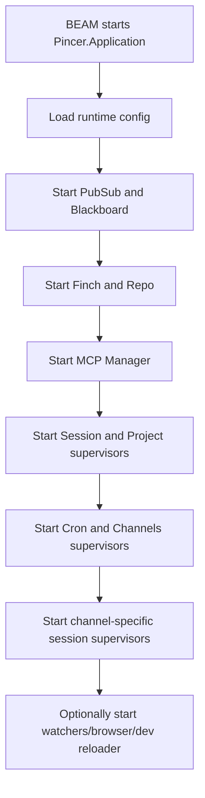
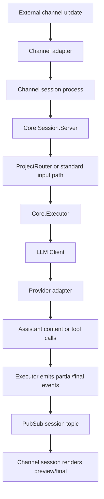
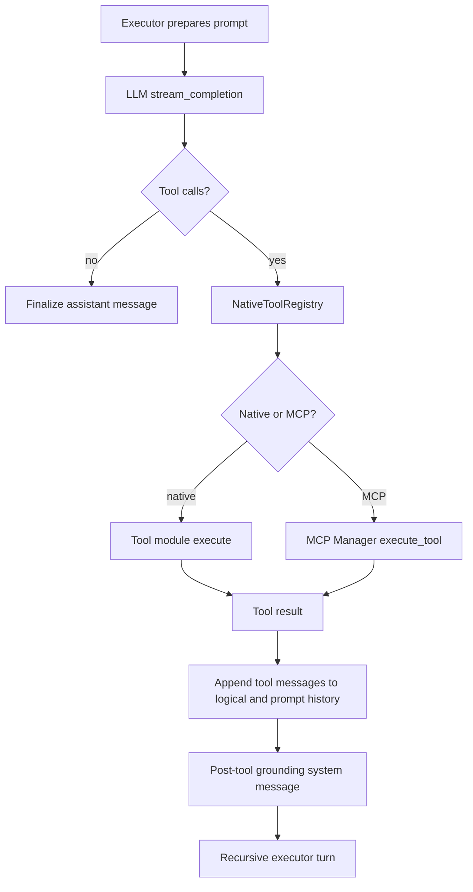
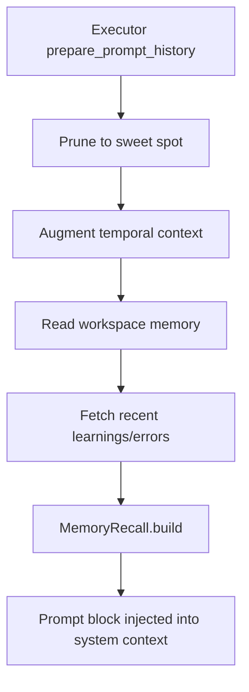
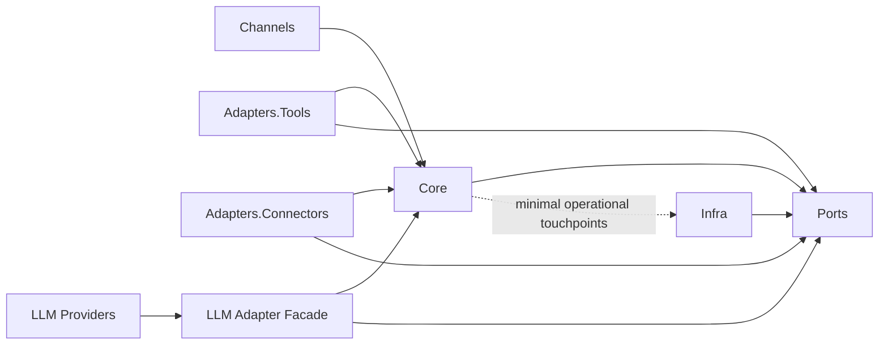

# Pincer Architecture And Boundaries Report

Date: 2026-03-13

## Scope

This report covers the current architectural state of `Pincer`, the desired target state, the main runtime flows, and a proposed technical roadmap for boundaries.

This report bundle includes two generated appendices:

- [Pincer API Appendix](/home/micelio/git/Pincer/docs/architecture/pincer_api_appendix.md)
- [Pincer Lib Skeleton Appendix](/home/micelio/git/Pincer/docs/architecture/pincer_lib_skeletons.md)

The first appendix catalogs compiled module/function docs for the public surface. The second appendix catalogs structural source skeletons from `lib/**/*.ex`, including private functions where present.

## Executive Summary

`Pincer` is already converging on a real hexagonal architecture, but it is not yet living inside a strict boundary mesh. The codebase has the right nouns:

- `Core`
- `Ports`
- `Adapters`
- `Channels`
- `LLM`
- `Infra`
- `Utils`

The problem is not absence of architectural intent. The problem is that the intent is only partially enforced, while a meaningful amount of operational policy still lives in channel/session code and in broad umbrella namespaces.

The shortest honest summary is:

- the codebase is structurally ambitious
- the runtime is operationally rich
- the boundaries are real but still soft
- the best next move is to keep pulling policy into `Core`
- only after that should `boundary` enforcement be tightened aggressively

## Progress Since This Report

This report kicked off an active refactoring sequence on the same day. The roadmap is still valid, but Phase 1 is no longer only proposed work.

Implemented on `2026-03-13` after the report:

- `fix(text): centralize reasoning sanitization for channels`
- `fix(executor): harden tool fallback and hidden reasoning handling`
- `fix(session): surface friendly executor failures`
- `feat(core): pull channel delivery state into core policies`
- `feat(core): centralize stream delivery fallback`
- `feat(core): extract response envelope policy`
- `feat(core): centralize status delivery fallback`
- `feat(core): centralize project flow delivery`
- `fix(executor): strip fallback reasoning leaks`
- `feat(errors): route common provider failures explicitly`
- `feat(llm): fail fast on terminal error classes`
- `feat(executor): recover from context overflow`
- `fix(executor): fail on empty final responses`
- `feat(core): centralize turn outcome policy`
- `fix(browser): handle missing pool process`

New core policy modules introduced as part of that sequence:

- [Pincer.Core.StatusMessagePolicy](/home/micelio/git/Pincer/lib/pincer/core/status_message_policy.ex)
- [Pincer.Core.StreamDelivery](/home/micelio/git/Pincer/lib/pincer/core/stream_delivery.ex)
- [Pincer.Core.ResponseEnvelope](/home/micelio/git/Pincer/lib/pincer/core/response_envelope.ex)
- [Pincer.Core.StatusDelivery](/home/micelio/git/Pincer/lib/pincer/core/status_delivery.ex)
- [Pincer.Core.ProjectFlowDelivery](/home/micelio/git/Pincer/lib/pincer/core/project_flow_delivery.ex)
- [Pincer.Core.ContextOverflowRecovery](/home/micelio/git/Pincer/lib/pincer/core/context_overflow_recovery.ex)
- [Pincer.Core.TurnOutcomePolicy](/home/micelio/git/Pincer/lib/pincer/core/turn_outcome_policy.ex)

Operationally, this means:

- more preview/final/status/project delivery policy already moved out of channel sessions
- more provider/tool failure classes are explicit instead of collapsing into generic runtime noise
- the executor now treats empty responses and context overflow as first-class outcomes
- one class of browser infrastructure failure no longer crashes a turn

## Inventory Snapshot

Source inventory at the time of this report:

- `197` Elixir source files under `lib/`
- about `38,815` lines across `lib/**/*.ex`
- `67` files under `lib/pincer/core`
- `24` files under `lib/pincer/channels`
- `19` files under `lib/pincer/llm`
- `19` files under `lib/pincer/adapters`
- `15` files under `lib/pincer/tools`
- `12` files under `lib/pincer/ports`

Boundary compiler status:

- `:boundary` compiler is enabled in [mix.exs](/home/micelio/git/Pincer/mix.exs#L14)
- `ignore_unknown: true` is still enabled in [mix.exs](/home/micelio/git/Pincer/mix.exs#L15)

That single flag is the clearest signal that the architecture is still in a transitional phase.

## Current Architecture

### Top-Level Structure

Current umbrella boundaries:

- [Pincer](/home/micelio/git/Pincer/lib/pincer.ex)
- [Pincer.Core](/home/micelio/git/Pincer/lib/pincer/core.ex)
- [Pincer.Ports](/home/micelio/git/Pincer/lib/pincer/ports.ex)
- [Pincer.Infra](/home/micelio/git/Pincer/lib/pincer/infra.ex)
- [Pincer.Channels](/home/micelio/git/Pincer/lib/pincer/channels.ex)
- [Pincer.Adapters](/home/micelio/git/Pincer/lib/pincer/adapters.ex)
- [Pincer.Adapters.Tools](/home/micelio/git/Pincer/lib/pincer/adapters/tools.ex)
- [Pincer.Adapters.Connectors](/home/micelio/git/Pincer/lib/pincer/adapters/connectors.ex)
- [Pincer.LLM](/home/micelio/git/Pincer/lib/pincer/llm.ex)
- [Pincer.Utils](/home/micelio/git/Pincer/lib/pincer/utils.ex)
- [Pincer.Mix](/home/micelio/git/Pincer/lib/pincer.ex#L12)

Current dependency story at top level:

- `Core` depends on `Ports`, `Infra`, `Utils`
- `Channels` depends on `Core`, `Infra`, `Ports`, `Utils`
- `Adapters` depends on `Core`, `Ports`, `Infra`, `Utils`
- `LLM` depends on `Core`, `Infra`, `Ports`
- `Ports` depends on `Infra`
- `Utils` is largely leaf-like

This is directionally sound. The weakness is granularity.

### Runtime Topology

The supervision tree in [application.ex](/home/micelio/git/Pincer/lib/pincer/application.ex) is broad and operationally convenient, but it couples many concerns into default boot:

- `PubSub`
- `Blackboard`
- `MemoryObservability`
- `Finch`
- `Repo`
- `Heartbeat`
- `MCP Manager`
- `Session Registry`
- `HookDispatcher`
- `Session Supervisor`
- `Project Registry`
- `Project Supervisor`
- `Cron Scheduler`
- `Channels Supervisor`
- channel-specific session supervisors
- optional watchers and browser pool

This has two implications:

- production boot is feature-rich
- test/unit boot is heavier than it should be

### Control Plane Versus Data Plane

The control plane is effectively concentrated in:

- [Pincer.Core.Session.Server](/home/micelio/git/Pincer/lib/pincer/core/session/server.ex)
- [Pincer.Core.Executor](/home/micelio/git/Pincer/lib/pincer/core/executor.ex)
- [Pincer.LLM.Client](/home/micelio/git/Pincer/lib/pincer/llm/client.ex)
- [Pincer.Adapters.NativeToolRegistry](/home/micelio/git/Pincer/lib/pincer/adapters/native_tool_registry.ex)
- [Pincer.Storage.Adapters.Postgres](/home/micelio/git/Pincer/lib/pincer/storage/adapters/postgres.ex)

The transport/data plane is spread through:

- channel adapters
- MCP connectors
- tool adapters
- provider adapters

This is a healthy split in theory. In practice, some channel/session modules still own too much policy.

## Current Runtime Flows

### Boot Flow

Observations:

- boot is centralized and understandable
- boot is not profile-aware enough
- tests often inherit too much production boot behavior

### Inbound Conversation Flow

Observations:

- the pubsub-mediated fanout is good
- the channel session workers still do non-trivial presentation/state work
- the system is already close to a thin-adapter model, but not there yet

### Tool Execution Flow

Observations:

- tool orchestration is already quite centralized
- this is one of the strongest pieces of the current architecture
- recent fixes improved unsupported-tool fallback, reasoning separation, and empty post-tool response synthesis

### Memory/Recall Augmentation Flow

Observations:

- memory augmentation is powerful
- the augmentation path currently reaches into runtime/global state in ways that make isolated testing harder
- this is a prime candidate for further core consolidation behind smaller ports

## Strengths Of The Current State

- The codebase has explicit architectural vocabulary instead of accidental layering.
- The `Executor` is becoming a real core policy engine.
- The `Ports` layer exists and is already used in meaningful places.
- The `NativeToolRegistry` gives one unified tool surface over native tools and MCP.
- The Postgres adapter is broad but coherent: messages, graph, memory, and search are all implemented behind one storage port.
- The project already has boundary regression tests, not just a compiler flag.
- The transport surface is broad: CLI, Telegram, Discord, Slack, Webhook, WhatsApp.
- The codebase already thinks in terms of orchestration, projects, session scope, bindings, auth profiles, failover and telemetry.

## Weaknesses Of The Current State

- `ignore_unknown: true` means boundaries still tolerate undeclared movement.
- Some umbrellas are too wide to carry strong meaning yet.
- Channel session modules still own too much delivery policy and UI state choreography.
- Application boot is too heavy for unit/integration isolation.
- `Core` still depends on `Infra` directly in many places.
- `LLM` is a broad area rather than a cleanly segmented provider boundary mesh.
- Tools still span old and new naming/placement conventions.
- Test ergonomics are worse than they should be because a lot of tests still rely on `Application.ensure_all_started(:pincer)`.

## State Of Boundaries Today

### What Is Already Good

- `Mix` tasks are explicitly classified into `Pincer.Mix`.
- `Core`, `Ports`, `Infra`, `Channels`, `Adapters`, `LLM`, `Utils` already exist as recognizable umbrellas.
- There are targeted boundary regression tests in [boundary_exports_test.exs](/home/micelio/git/Pincer/test/pincer/boundary_exports_test.exs).
- There are already examples of a clean port-dispatcher pair:
  - [Pincer.Ports.Hook](/home/micelio/git/Pincer/lib/pincer/ports/hook.ex)
  - [Pincer.Core.HookDispatcher](/home/micelio/git/Pincer/lib/pincer/core/hook_dispatcher.ex)
  - [Pincer.Ports.MediaUnderstanding](/home/micelio/git/Pincer/lib/pincer/ports/media_understanding.ex)
  - [Pincer.Adapters.MediaDispatcher](/home/micelio/git/Pincer/lib/pincer/adapters/media_dispatcher.ex)

### What Is Not Mature Yet

- `Pincer.Channels` is still one large umbrella rather than a true thin-transport layer.
- `Pincer.Adapters` is more a namespace than a defended boundary.
- `Pincer.LLM` is wide and operationally dense.
- `Core` is still a large landing zone that mixes orchestration, policy, project flow, memory logic, and some infrastructural coordination.
- The codebase has more boundary declarations than boundary precision.

## Desired Architecture

The desired target state should be:

- `Core` owns policy, orchestration, interaction state, and domain rules
- `Ports` owns only stable contracts
- `Adapters` implement ports and stay thin
- `Channels` become transport/render adapters with minimal policy
- `LLM` provider modules become implementations behind a smaller provider-facing contract
- `Infra` becomes operational substrate, not a dependency shortcut
- application boot becomes profile-aware

### Desired Dependency Shape

The main change is not cosmetic. The main change is to stop letting channel and adapter code become a second core.

### Desired Session/Channel Split

Current tendency:

- channel session workers own rendering policy
- core owns orchestration policy

Desired split:

- core owns preview/final semantics, reasoning visibility rules, tool-followup rules, status message policies, and interaction envelope formation
- channels own only format conversion and transport-specific send/edit primitives

### Desired Testability

Desired test posture:

- `Core` tests should mostly run without full app boot
- `Executor` tests should not require broad application startup
- `Repo`-backed tests should opt into DB, not drag DB into everything
- channels should be testable with transport fakes and core callbacks

## Desired State By Subsystem

### Core

Desired:

- further split into sub-boundaries such as `Core.Session`, `Core.Executor`, `Core.Project`, `Core.Memory`, `Core.LLMPolicy`, `Core.UX`, `Core.Orchestration`
- treat `Core` as the only owner of cross-channel conversational policy

### Ports

Desired:

- smaller, stricter, stable contracts
- no casual leakage of infra shapes into port APIs
- more explicit seams around recall, embeddings, interaction rendering and session persistence

### Channels

Desired:

- one thin adapter per channel
- one transport API module per channel
- one session glue module only when transport semantics require it
- no channel-specific reinvention of core conversation policy

### Adapters

Desired:

- explicit sub-boundaries for tools, connectors, media and scheduling
- no direct policy ownership
- adapters should convert between external shape and core shape

### LLM

Desired:

- provider implementations stay behind one clean provider contract
- retry/cooldown/failover policy belongs to core policy modules or a dedicated `LLM.Policy` area
- minimize direct call chains from core into provider-specific quirks

### Infra

Desired:

- repo, pubsub, config, telemetry sinks and external process bootstrapping stay here
- application profiles should let tests boot only the infra they need

## Appendix Bundle

The full function skeleton mapping requested for this report is included as:

- [Pincer API Appendix](/home/micelio/git/Pincer/docs/architecture/pincer_api_appendix.md)
  - compiled public surface with extracted docs
- [Pincer Lib Skeleton Appendix](/home/micelio/git/Pincer/docs/architecture/pincer_lib_skeletons.md)
  - source-level structural skeleton across `lib/**/*.ex`, including private definitions where present

Together they provide:

- module inventory
- module docs
- public function/macro/callback docs
- private/source skeleton signatures

## Proposed Technical Roadmap For Boundaries

### Phase 1: Finish Pulling Policy Into Core

Goal:

- make `Core` the unquestioned owner of conversational policy before tightening boundary enforcement

Actions:

- continue extracting preview/final delivery policy into core helpers
- centralize channel interaction envelopes in core
- move more post-tool response shaping into core
- move more reasoning-visibility and status-message decisions into core
- isolate memory recall augmentation behind smaller core-facing seams
- reduce direct channel/session duplication

Status:

- in progress, with meaningful partial completion already landed on `2026-03-13`

Completed slices:

- preview/final delivery fallback moved into [Pincer.Core.StreamDelivery](/home/micelio/git/Pincer/lib/pincer/core/stream_delivery.ex)
- response envelope formation moved into [Pincer.Core.ResponseEnvelope](/home/micelio/git/Pincer/lib/pincer/core/response_envelope.ex)
- status upsert/delivery policy moved into [Pincer.Core.StatusMessagePolicy](/home/micelio/git/Pincer/lib/pincer/core/status_message_policy.ex) and [Pincer.Core.StatusDelivery](/home/micelio/git/Pincer/lib/pincer/core/status_delivery.ex)
- project flow delivery moved into [Pincer.Core.ProjectFlowDelivery](/home/micelio/git/Pincer/lib/pincer/core/project_flow_delivery.ex)
- turn outcome classification moved into [Pincer.Core.TurnOutcomePolicy](/home/micelio/git/Pincer/lib/pincer/core/turn_outcome_policy.ex)
- tool-only degraded-response formatting moved into [Pincer.Core.ToolOnlyOutcomeFormatter](/home/micelio/git/Pincer/lib/pincer/core/tool_only_outcome_formatter.ex)
- lightweight web capability split into explicit `web_search` and `web_fetch` tool interfaces in [Pincer.Adapters.Tools.Web](/home/micelio/git/Pincer/lib/pincer/tools/web.ex)
- browser capability is now hidden from the registry when browser infra is disabled, keeping simple URL reads on lightweight web tools
- first-turn `empty_response` now attempts a lightweight chat recovery before surfacing provider-empty UX
- prompt pruning and system-context assembly moved out of the executor loop into a dedicated core prompt-assembly seam
- channel status/error classification moved into [Pincer.Core.ChannelEventPolicy](/home/micelio/git/Pincer/lib/pincer/core/channel_event_policy.ex)
- WhatsApp session flow now reuses [Pincer.Core.ProjectFlowDelivery](/home/micelio/git/Pincer/lib/pincer/core/project_flow_delivery.ex) instead of owning `ProjectRouter` replay logic directly

Operational impact observed after these slices:

- simple URL-reading requests should no longer select `browser` when browser infra is off; the intended path is the lightweight `web_fetch` tool
- first-turn/provider-empty greetings now have a recovery attempt before the channel receives provider-empty UX
- session workers are now materially closer to transport glue, with remaining failures concentrated around explicit tool/infra classification rather than silent or misleading channel behavior

Still open inside Phase 1:

- no major blockers remain for the original Phase 1 scope; remaining cleanup now fits better as Phase 2 boundary sharpening

Exit criteria:

- Telegram, Discord, Slack and WhatsApp session workers look mostly like transport glue
- core tests cover behavior that is currently duplicated in channel code

### Phase 2: Introduce Finer-Grained Boundaries

Goal:

- replace broad umbrellas with more meaningful internal fences

Actions:

- split `Pincer.Core` into sub-boundaries
- split `Pincer.Channels` into thin transport areas if needed
- split `Pincer.LLM` into provider-facing versus policy-facing areas
- split `Pincer.Adapters` into sharper sub-boundaries with explicit deps
- classify more leaf modules instead of relying only on umbrellas

Status:

- started on `2026-03-13`, with `Pincer.Core.UX` promoted to an explicit sub-boundary
- `Pincer.Core` still re-exports `UX.MenuPolicy` and `UX.ModelKeyboard` as a temporary bridge while `Channels` continues to consume them through the parent core boundary
- empty-response lightweight recovery is now explicitly gated to low-risk smalltalk, preventing factual/workspace questions from receiving invented fallback answers
- `web_fetch` transport failures now pass through a pure formatter, so TLS hostname mismatch and timeout errors stop polluting the tool result with giant transport dumps
- executor coverage now locks in the degraded `tool_only` path for post-tool empty finals, matching the intended behavior seen in `TurnOutcomePolicy`
- `web_fetch` now attempts a safe `http://host` fallback after `https://host` fails with TLS hostname mismatch, while preserving URL validation and redirect checks
- post-tool grounding now carries tool-family-specific answer patterns for Git/GitHub flows, teaching the model how to summarize successful `git_inspect` and GitHub results instead of stalling on raw output
- `git_inspect` stderr now flows through a pure formatter, turning common repository/path/reference failures into short actionable messages
- the `github` tool now routes common API and transport failures through a pure formatter, replacing raw GitHub/Req error payloads with short actionable messages
- the `github` tool now reads its HTTP client from configuration, which creates a clean seam for deterministic error-path tests without global HTTP patching
- degraded `tool_only` turns now produce a more useful fallback for successful Git/GitHub tools, instead of collapsing everything into raw previews when the model fails after tool execution
- that summarization logic now lives in a dedicated pure helper, keeping `ToolOnlyOutcomeFormatter` focused on degraded-response UX rather than per-tool parsing rules
- the same degraded path now summarizes GitHub/MCP collection results (`list_issues`, `list_prs`, `list_commits`, `search_code`, `list_repos`) into compact semantic lines, which makes empty-final failures far less destructive for real work

Exit criteria:

- the majority of important modules belong to a semantically precise boundary
- architectural violations become locally intelligible

### Phase 3: Tighten Enforcement

Goal:

- turn the architecture from advisory to defended

Actions:

- remove or reduce `ignore_unknown: true`
- add boundary tests for forbidden imports across more subsystems
- fail CI on undeclared crossings
- add minimal boot profiles for tests so stricter boundaries do not slow iteration

Exit criteria:

- unknown crossings are exceptions, not baseline
- developers can trust `boundary` failures as signal rather than noise

### Phase 4: Optimize For Operability

Goal:

- make the strict architecture easy to work with

Actions:

- add `test_minimal` or equivalent application boot profile
- make repo usage opt-in in more tests
- document standard adapter/core patterns with examples
- provide generator templates for new ports/adapters/channels

Exit criteria:

- adding a new adapter or channel naturally follows the architecture instead of fighting it

## Recommendation

Do not start by tightening boundaries harder.

Start by:

- moving more behavior into `Core`
- thinning adapters and channels
- then splitting umbrellas into narrower boundaries
- then removing `ignore_unknown`

That order minimizes regret. If enforcement is tightened too early, the team will spend time negotiating boundary friction around responsibilities that are still moving. If policy is centralized first, boundary enforcement becomes much more mechanical and much less political.
